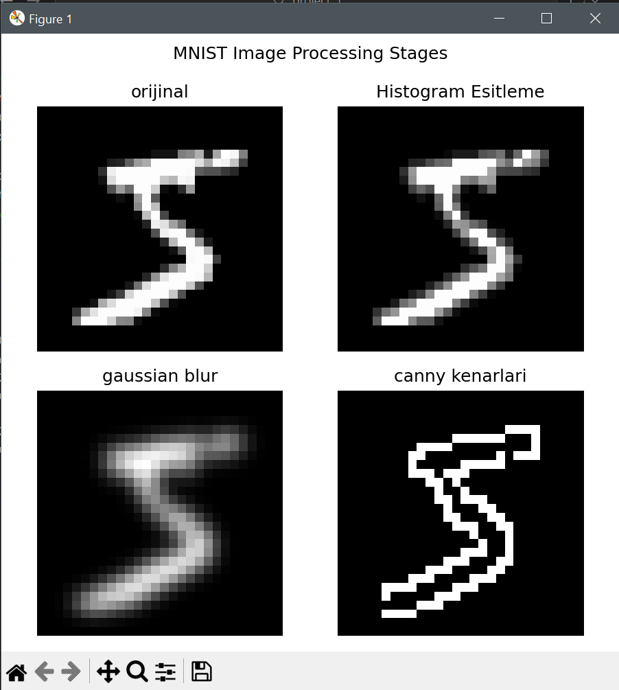
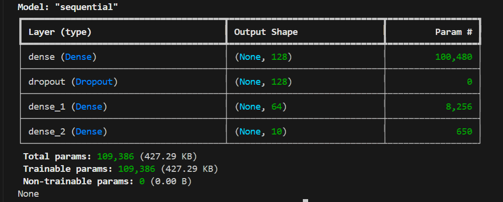
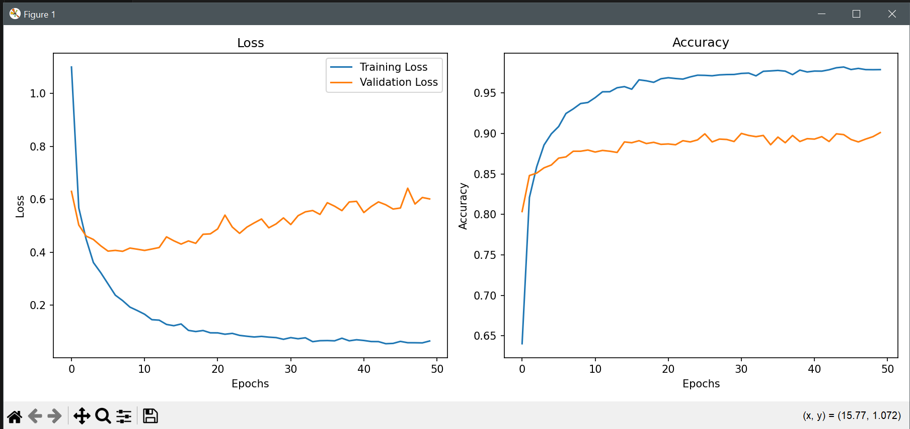

# MNIST Digit Classification - ANN and Image Processing

This project performs digit classification using Artificial Neural Networks (ANN) on the MNIST dataset.

## Features
- Contrast enhancement using histogram equalization
- Noise reduction using Gaussian blur
- Edge detection using Canny edge detection
- 3-layer ANN model
- 90.10% test accuracy

## Technologies Used
- Python 3.x
- TensorFlow/Keras
- OpenCV
- NumPy
- Matplotlib

## Results
## Image Processing Stages

## Model Architecture

## Model Performance

## Model Architecture
- Input Layer: 128 neurons (ReLU)
- Dropout: 0.5
- Hidden Layer: 64 neurons (ReLU)
- Output Layer: 10 neurons (Softmax)

## Performance
- Training Accuracy: 97.88%
- Test Accuracy: 90.10%
- Test Loss: 0.6011

